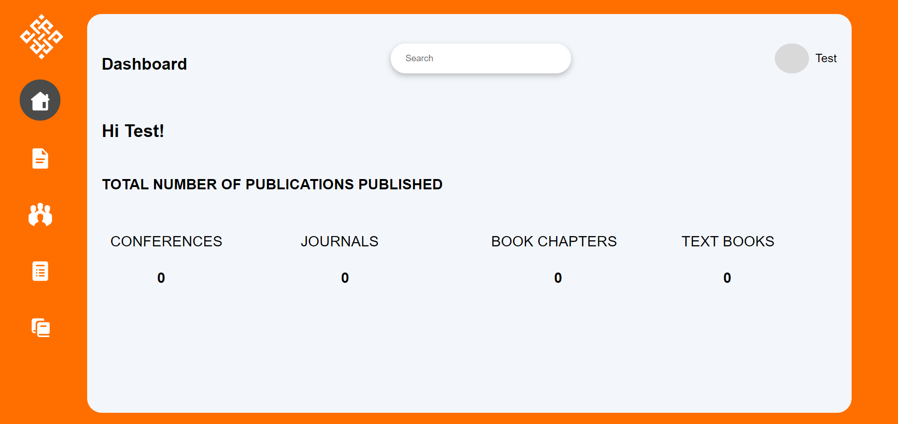
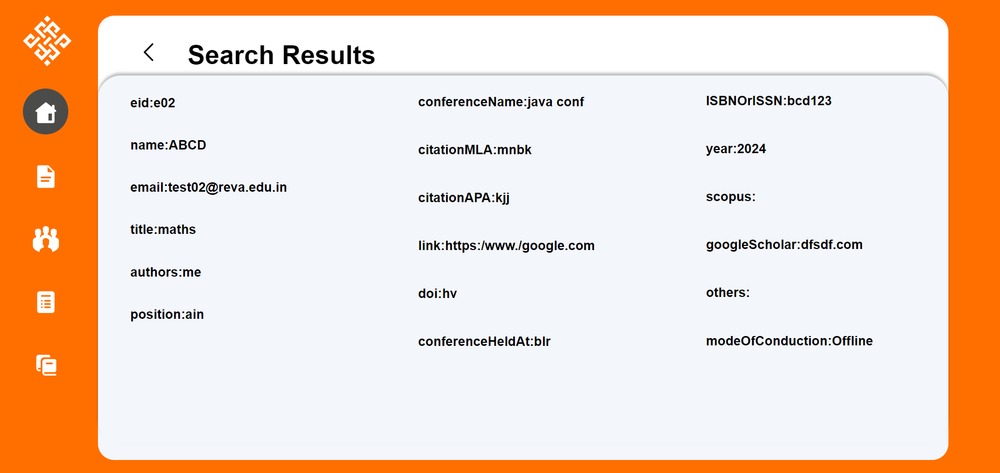
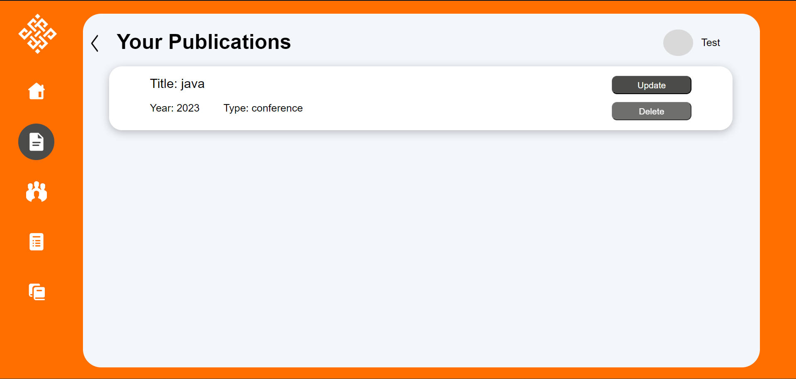
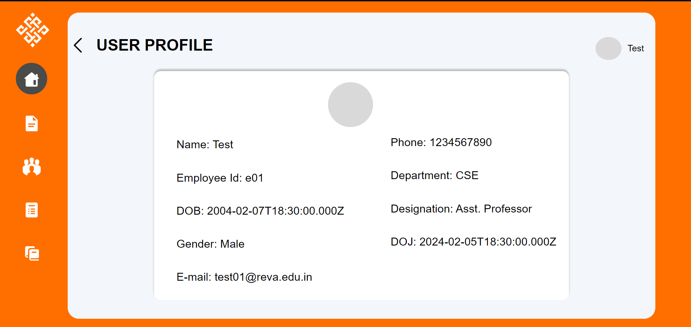

# 📚 EduPublishPortal  

## 🚀 Overview  
EduPublishPortal is a web-based platform where researchers, academicians, and students can **upload, share, and explore** academic publications 📄. Whether it's a **conference paper, research paper, or any other scholarly work**, this platform helps in fostering knowledge-sharing and collaboration.  

## ✨ Features  
✅ **User Authentication**: Secure login system 🔒  
✅ **Upload Publications**: Share research papers, conference papers, and more 📑  
✅ **Explore & Reference**: Browse through publications for research purposes 🔍  
✅ **Tech-Driven**: Built with modern web technologies 💻  
✅ **Local Database**: Uses MySQL via XAMPP for local hosting 🛠️  

## 🛠️ Tech Stack  
- **Frontend**: React.js ⚛️  
- **Backend**: Express.js (Node.js) 🟢  
- **Database**: MySQL (Managed locally using XAMPP) 🗄️  

## 📥 Installation & Setup  

### Prerequisites  
Before running the project, ensure you have:  
- ✅ **Node.js & npm** installed  
- ✅ **XAMPP** installed and MySQL server running  

### 🔧 Steps to Run the Project  

#### 1️⃣ Clone the Repository  
```sh
git clone https://github.com/mohithn2004/EduPublishPortal
cd EduPublishPortal
```

#### 2️⃣ Backend Setup  
```sh
cd src/components
npm install
node backend.js
```

#### 3️⃣ Frontend Setup  
```sh
npm install
npm start
```

#### 4️⃣ Database Setup  
- Open **XAMPP** and start the **Apache** and **MySQL** services.  
- Open `phpMyAdmin` and create a database named **`edupublish`**.  

## 🖼️ Snapshots  
Get a glimpse of the platform in action!  

  

 

 

 

 

 

## 🤝 Contributing  
We welcome contributions! Feel free to fork the repo, submit pull requests, or report issues.  

## 📧 Contact  
Got questions or suggestions? Reach out at **mohithn2004@gmail.com**.  

Happy researching! 🎓✨  
